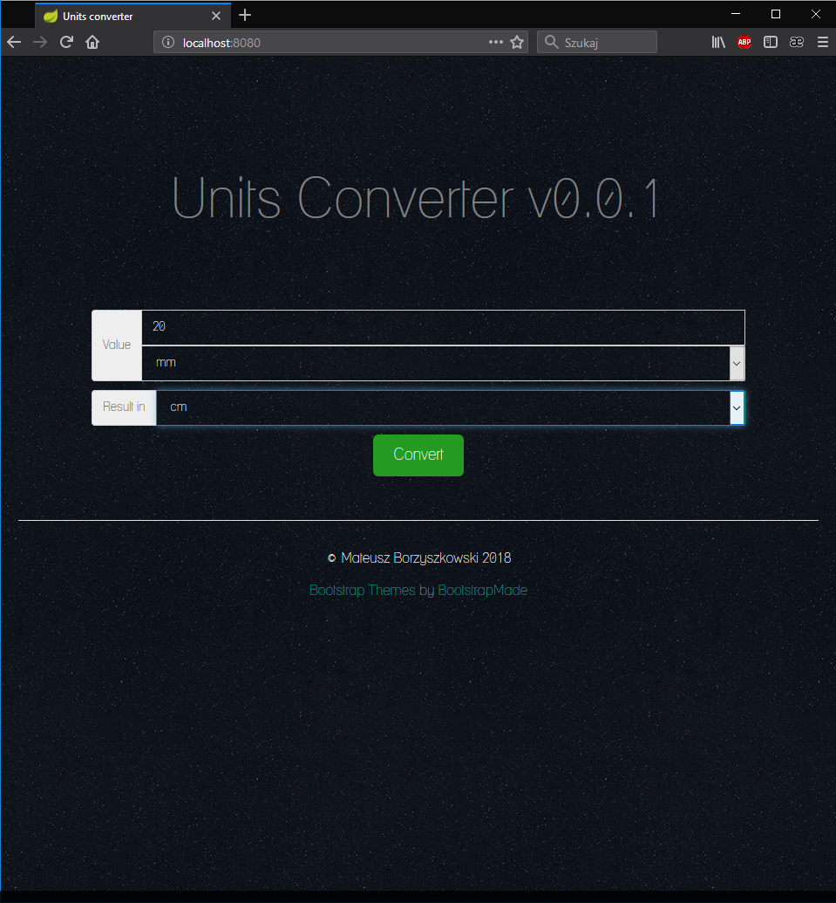
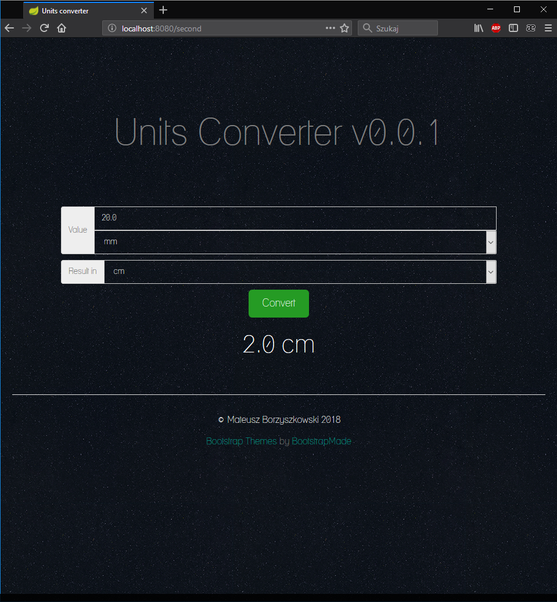

# UNITS CONVERTER

### Description
The simple application that converts units of length. The user gives the value, selects the length unit and the length unit for the result. The application converts milimeters, centimeters, decimeters, meters and kilometers.

The application contains paradigms OOP and collections(Map). The Maven tool has been used in project.

Used technologies:
- Java Spring,
- Bootstrap,
- HTML, CSS, JS.

